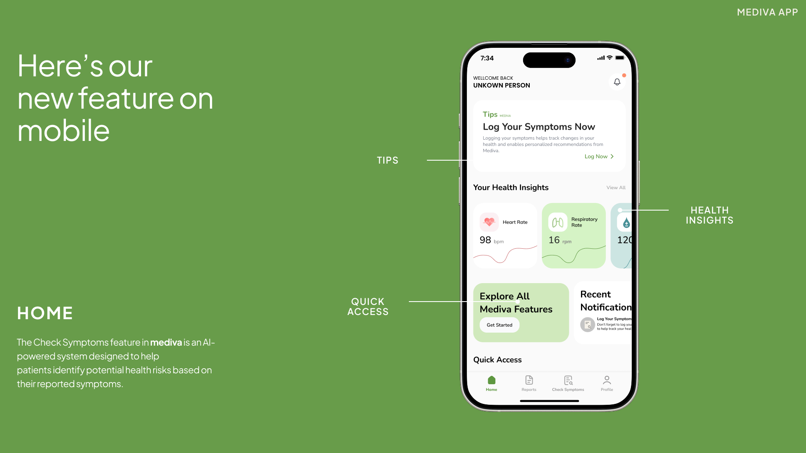

# Chronic Diseases

[](https://flutter.dev/)
[](https://dart.dev/)

A cross-platform Flutter application focused on chronic disease management and health insights. This repository contains the app source, assets, and platform targets for Android, iOS, Web and desktop platforms.

## Key Features

### Core Functionality
- Symptom logging with date/time and optional notes
- Symptom trend views and simple charts for self-monitoring
- Guided health information and educational widgets
- Local notification reminders for medication/monitoring
- Onboarding and authentication flows (Sign Up, Login, Reset Password)
- Persistent local storage for sessions and user data

### UX & Accessibility
- Responsive layouts for phones, tablets and web
- Themed (light/dark) styling via centralized `AppThemes`
- Reusable UI components in `lib/core/widgets_core`
- Asset-driven icons and images for consistent branding

### Privacy & Data
- Primary storage: local device storage (no backend by default)
- Explicit note: review any added analytics, cloud sync, or push services before enabling them

## Project Structure

```
lib/
  core/
    app_color.dart
    assets.dart
    styles.dart
    user_session.dart
    utils/
    widgets_core/
  models/
    Notification/notifications.dart
    checkSymptoms/
    Login/
    SignUp/
    resetPassword/
    CreatePassword_Code/
  ui/
    screen/
    Widgets/
  app_routes.dart
  main.dart

android/ ios/ web/ windows/ macos/ linux/  # platform folders
assets/  # icons, images
fonts/
test/
```


## Design preview





